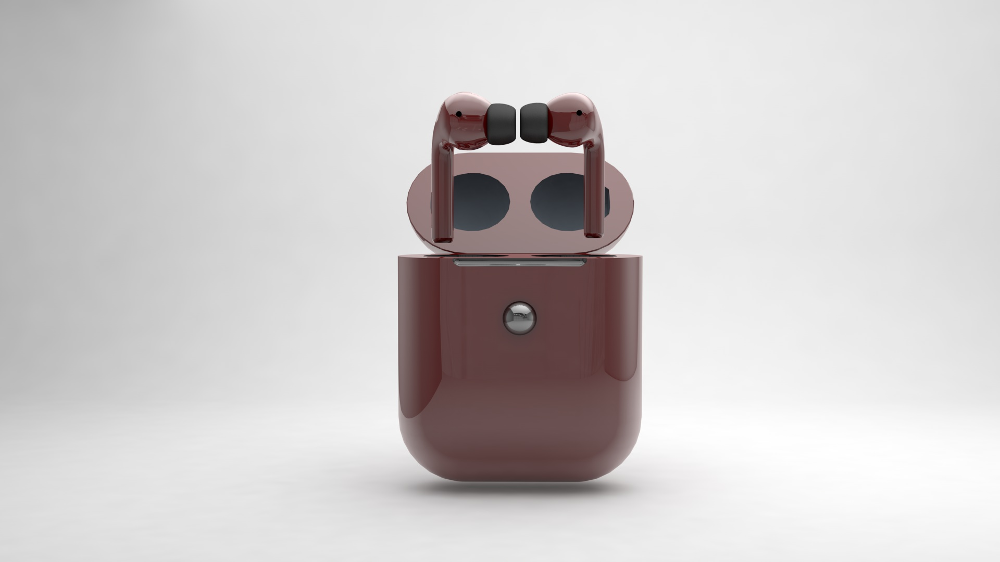

# Klint Earbuds Promotional Site

Overview
This assignment is designed to inspire students to delve into the world of innovative earbud design. The primary objective is for students to employ Cinema 4D to create 3D models, apply textures, lighting, and animations to bring their designs to life. These digital assets will serve as essential resources for a promotional website, showcasing their creative ideas to the world.

## Plan

Creative Expression: Encourage students to explore and express their creativity through the design of innovative earbuds.

Cinema 4D Proficiency: Develop proficiency in using Cinema 4D to create detailed 3D models, apply textures, set up realistic lighting, and incorporate animations.

Promotional Assets: Generate high-quality digital assets that will serve as the focal point of a promotional website for the Klint Earbuds.

Start with the basics: use files and resources given in class, build a structure, and start branding.

Apply branding and styling to website.

Develop advanced 3D and vector graphics.

Finalize by bringing it all together into one complete site.

## Usage

Learn more about our new earbuds concept!

## Contributing

1. Fork it!
2. Create your feature branch: `git checkout -b my-new-feature`
3. Commit your changes: `git commit -am 'Add some feature'`
4. Push to the branch: `git push origin my-new-feature`
5. Submit a pull request :D

## Credits
code: Kirk Caspe
design: Kirk Caspe

## License
